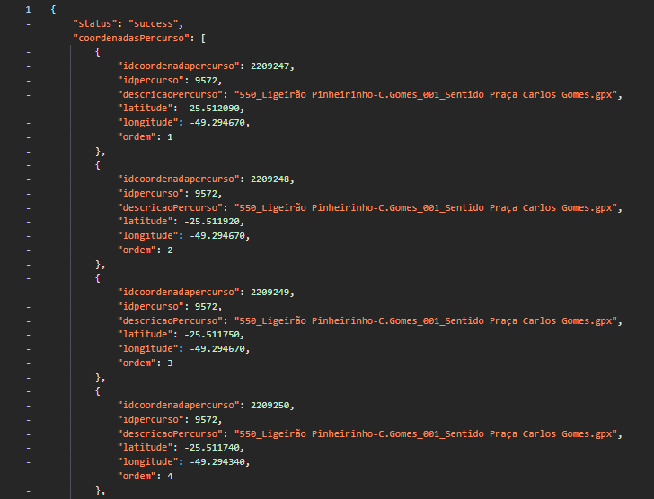
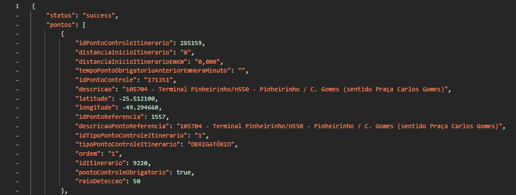
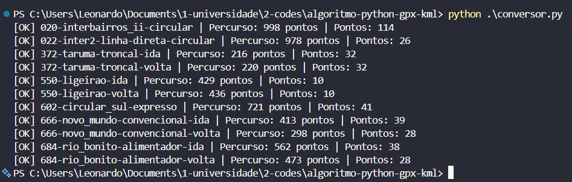
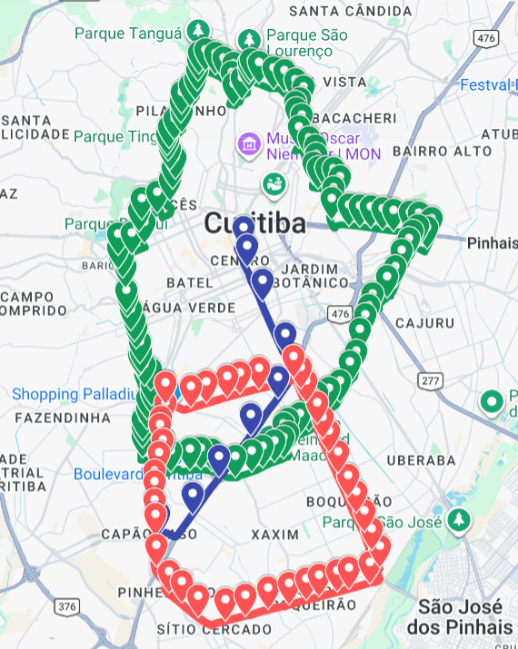

# Conversor de Rotas JSON para GPX e KML

**Automação para processamento de dados geográficos de linhas de transporte público, convertendo arquivos JSON em rotas padronizadas nos formatos GPX e KML.**

> Desenvolvido em Python para automatizar a interpretação de coordenadas, pontos de controle e percursos, facilitando a geração e visualização de rotas utilizadas no mapeamento do transporte público de Curitiba.


## Sobre o projeto

Este projeto foi desenvolvido para automatizar a transformação de dados de percursos disponibilizados em estruturas **JSON** pelas plataformas utilizadas no contexto do transporte coletivo de Curitiba.

A aplicação interpreta os arquivos de percurso e de pontos de controle, identifica e organiza coordenadas geográficas, remove registros duplicados, ordena os pontos quando existe informação de ordem e gera arquivos padronizados nos formatos **GPX** e **KML**.

A solução foi criada com foco em **reduzir etapas manuais, aumentar a padronização e agilizar o mapeamento de linhas do transporte coletivo**, especialmente no contexto das atividades relacionadas à nova licitação do transporte público de Curitiba em 2026.

---

## Demonstração

> **As imagens abaixo são placeholders.**

### Dados de entrada

Exemplo da estrutura JSON utilizada como entrada:

<div align="left">
  
</div>

<div align="left">
  
</div>

### Execução do conversor

<div align="left">
  
</div>

### Rota gerada em mapa

<div align="left">
  
</div>

---

## Objetivos

- Automatizar o processamento de dados de percursos;
- Transformar coordenadas geográficas brutas em trajetos estruturados;
- Converter dados JSON em arquivos GPX e KML;
- Identificar e organizar pontos de controle;
- Eliminar registros duplicados;
- Preservar a ordem dos pontos do percurso;
- Facilitar a visualização das linhas em ferramentas de mapas e geolocalização;
- Reduzir o tempo necessário para criação manual dos trajetos;
- Padronizar os arquivos utilizados no processo de mapeamento.

---

## Como funciona

O fluxo principal da aplicação pode ser resumido da seguinte forma:

```text
Dados JSON
    │
    ├── percurso.json
    │
    └── pontos.json
            │
            ▼
    Leitura e interpretação
            │
            ▼
    Extração das coordenadas
            │
            ▼
    Remoção de duplicidades
            │
            ▼
    Ordenação dos pontos
            │
            ▼
    Geração dos arquivos
        ┌───────────────┐
        │               │
        ▼               ▼
      GPX             KML
        │               │
        └───────┬───────┘
                ▼
       Visualização em
       ferramentas de mapas
```

### 1. Entrada dos dados

Cada linha possui uma pasta dentro de `json/`, contendo:

- `percurso.json`: informações das coordenadas que formam o trajeto;
- `pontos.json`: informações dos pontos de controle associados ao percurso.

Exemplo:

```text
json/
└── 020-interbairros_ii-circular/
    ├── percurso.json
    └── pontos.json
```

### 2. Processamento

O arquivo `conversor.py` percorre automaticamente as pastas existentes em `json/`.

Para cada linha, o programa:

1. verifica a existência dos arquivos necessários;
2. carrega os arquivos JSON;
3. percorre recursivamente suas estruturas;
4. extrai latitude e longitude;
5. identifica os pontos de controle;
6. remove coordenadas e pontos duplicados;
7. organiza os registros de acordo com a ordem disponível;
8. gera os arquivos de saída.

### 3. Geração dos arquivos

Para cada linha processada são gerados dois arquivos:

```text
saida/
├── nome-da-linha.gpx
└── nome-da-linha.kml
```

O **GPX** contém o trajeto como uma track e os pontos de controle como waypoints.

O **KML** contém o trajeto como uma linha e os pontos de controle como marcadores, incluindo informações complementares como identificação, tipo e distância.

---

## Estrutura do projeto

```text
conversor-percursos-urbs-dataprom/
│
├── conversor.py
│
├── json/
│   ├── 020-interbairros_ii-circular/
│   │   ├── percurso.json
│   │   └── pontos.json
│   │
│   ├── 022-inter2-linha-direta-circular/
│   │   ├── percurso.json
│   │   └── pontos.json
│   │
│   ├── 372-taruma-troncal-ida/
│   │   ├── percurso.json
│   │   └── pontos.json
│   │
│   └── ...
│
├── saida/
│   ├── *.gpx
│   └── *.kml
│
├── docs/
│   └── images/
│       ├── visao-geral.png
│       ├── entrada-json.png
│       ├── execucao-terminal.png
│       ├── rota-mapa.png
│       └── visualizacao-kml.png
│
├── .gitignore
├── LICENSE
└── README.md
```

---

## Tecnologias

- **Python 3**
- **JSON**
- **XML**
- **GPX**
- **KML**
- Coordenadas geográficas
- `pathlib`
- `xml.etree.ElementTree`

O projeto utiliza exclusivamente recursos disponíveis na biblioteca padrão do Python, não sendo necessária a instalação de pacotes externos para executar o conversor.

---

## Execução

### Pré-requisitos

- Python 3 instalado;
- Dados de entrada organizados conforme a estrutura esperada.

Verifique a instalação:

```bash
python --version
```

### Executando o projeto

Na raiz do repositório:

```bash
python conversor.py
```

O programa localizará automaticamente as pastas dentro de `json/` e processará cada linha encontrada.

Durante a execução, são exibidas mensagens indicando o resultado do processamento, por exemplo:

```text
[OK] 020-interbairros_ii-circular | Percurso: XXXX pontos | Pontos: XX
```

Os arquivos gerados serão armazenados automaticamente em:

```text
saida/
```

---

## Principais componentes

### `carregar_json()`

Responsável por abrir e interpretar os arquivos JSON utilizando codificação UTF-8.

### `extrair_coordenadas()`

Percorre recursivamente os dados recebidos e identifica objetos que possuem `latitude` e `longitude`, validando os limites das coordenadas geográficas.

### `extrair_pontos()`

Localiza pontos de controle e coleta informações como:

- latitude;
- longitude;
- ordem;
- descrição;
- identificadores;
- tipo do ponto;
- distância desde o início do itinerário.

### `remover_duplicados_percurso()`

Remove coordenadas duplicadas considerando latitude, longitude e ordem.

### `remover_duplicados_pontos()`

Remove pontos de controle repetidos utilizando suas coordenadas e identificadores.

### `ordenar_percurso()` e `ordenar_pontos()`

Organizam os registros de acordo com a informação de ordem disponível nos dados de origem.

### `criar_gpx()`

Gera um arquivo GPX contendo:

- identificação do percurso;
- track do trajeto;
- pontos de controle como waypoints;
- informações descritivas dos pontos.

### `criar_kml()`

Gera um arquivo KML contendo:

- trajeto representado por uma linha;
- marcadores para os pontos de controle;
- descrição e informações dos pontos;
- estilo visual aplicado ao trajeto.

### `processar_linha()`

Coordena o processamento individual de cada linha.

### `main()`

Localiza automaticamente as pastas de linhas e inicia o processamento de cada uma delas.

---

## Formatos gerados

### GPX

O formato **GPX (GPS Exchange Format)** é utilizado para representar informações de posicionamento e trajetos. Neste projeto, o arquivo gerado contém o percurso como uma sequência de pontos de track e os pontos de controle como waypoints.

### KML

O formato **KML (Keyhole Markup Language)** permite representar informações geográficas em plataformas compatíveis com dados de mapas. Neste projeto, o trajeto é representado por uma linha e os pontos de controle são apresentados como marcadores.

---

## Aplicação prática

A ferramenta foi concebida para apoiar atividades de **mapeamento e tratamento de dados do transporte coletivo de Curitiba**.

A automatização é especialmente útil quando existe a necessidade de processar diferentes linhas e sentidos de operação, pois o programa consegue executar o mesmo procedimento para múltiplas pastas sem a necessidade de desenhar individualmente cada trajeto.

Com isso, o processo deixa de depender exclusivamente de operações manuais e passa a utilizar uma rotina programática padronizada.

---

## Resultados

A utilização do conversor proporciona:

- **Automatização:** processamento das linhas sem necessidade de conversão manual individual;
- **Padronização:** geração dos arquivos seguindo uma estrutura consistente;
- **Eficiência:** redução do trabalho operacional envolvido no desenho dos trajetos;
- **Organização:** separação clara entre dados de entrada e arquivos gerados;
- **Rastreabilidade:** preservação das informações de percurso e dos pontos de controle;
- **Interoperabilidade:** utilização dos resultados em diferentes ferramentas compatíveis com GPX e KML.

---

## Dados de exemplo

O repositório contém exemplos de dados utilizados durante o desenvolvimento e teste da solução.

As pastas de entrada representam diferentes linhas e configurações de percurso, incluindo trajetos circulares e operações nos sentidos de ida e volta.

Os arquivos gerados em `saida/` demonstram o resultado da conversão dos dados de entrada para GPX e KML.

> **Observação:** os dados de origem pertencem ao contexto das plataformas e sistemas que os disponibilizam. A inclusão de dados neste repositório deve ser considerada exclusivamente para fins de demonstração, desenvolvimento e documentação, respeitando eventuais termos de uso, direitos e políticas aplicáveis às fontes originais.

---

## Possíveis evoluções

Entre as possibilidades de evolução do projeto estão:

- criação de uma interface gráfica;
- processamento de arquivos JSON selecionados pelo usuário;
- suporte a outros formatos geográficos;
- geração de relatórios de processamento;
- validações mais avançadas das coordenadas;
- identificação automática de inconsistências;
- configuração dos diretórios de entrada e saída;
- processamento de arquivos em lote com parâmetros personalizados;
- integração direta com APIs ou fontes de dados autorizadas.

---

## Contexto profissional

Este projeto demonstra a aplicação prática de **Python, processamento de dados, manipulação de arquivos estruturados, geolocalização e automação de processos** em um problema real relacionado ao transporte coletivo.

A solução foi desenvolvida com o objetivo de transformar dados brutos em informações geográficas estruturadas, reduzindo tarefas repetitivas e contribuindo para um processo de mapeamento mais rápido e padronizado.

---

## Autor

**Leonardo Schimock**

Estudante de Engenharia de Software, com interesse em desenvolvimento de software, automação, processamento de dados e aplicação de tecnologia na resolução de problemas reais.

---

## Licença

Este projeto está disponibilizado sob a licença MIT para o código-fonte, conforme arquivo `LICENSE`.

Os dados de entrada e arquivos derivados presentes no repositório podem estar sujeitos a condições de uso distintas das aplicáveis ao código-fonte. Consulte as condições das respectivas fontes antes de reutilizá-los fora deste contexto.
